                   **Exploratory Data Analysis of the Heart Failure Clinical Data**


```python
#import the required libraries 

# supress warnings 
from warnings import filterwarnings
filterwarnings('ignore')

# 'Pandas' is used for data manipulation and analysis
import pandas as pd 

# 'Numpy' is used for mathematical operations on large, multi-dimensional arrays and matrices
import numpy as np

# 'Matplotlib' is a data visualization library for 2D and 3D plots, built on numpy
import matplotlib.pyplot as plt
%matplotlib inline

# 'Altair' is a data visualization library for 2D and 3D plots
import altair as alt

# 'Scikit-learn' (sklearn) emphasizes various regression, classification and clustering algorithms
from sklearn.model_selection import train_test_split
from collections import defaultdict
alt.renderers.enable('mimetype')
```


    RendererRegistry.enable('mimetype')


```python
# pip install seaborn

```

## **Understanding the Data**

> **Column Description**

1. **Age**: Age of the patient
2. **Anaemia**: Decrease of red blood cells or hemoglobin.
3. **High blood pressure**: If a patient has hypertension.
4. **Creatinine phosphokinase**: Level of the CPK enzyme in the blood.
5. **Diabetes**:If the patient has diabetes.
6. **Ejection fraction**: Percentage of blood leaving the heart at each contraction.
7. **Sex**: Woman(0) or man(1).
8. **Platelets**: Platelets in the blood.
9. **Serum creatinine**: Level of creatinine in the blood.
10. **Serum sodium**: Level of sodium in the blood.
11. **Smoking**: If the patient smokes.
12. **Time**: Follow-up period.
13. **(target) death event**: If the patient died during the follow-up period.


```python
# Load data
df = pd.read_csv('../data/raw/heart_failure_clinical_records_dataset.csv')
df
```


<div>
<style scoped>
    .dataframe tbody tr th:only-of-type {
        vertical-align: middle;
    }

    .dataframe tbody tr th {
        vertical-align: top;
    }

    .dataframe thead th {
        text-align: right;
    }
</style>
<table border="1" class="dataframe">
  <thead>
    <tr style="text-align: right;">
      <th></th>
      <th>age</th>
      <th>anaemia</th>
      <th>creatinine_phosphokinase</th>
      <th>diabetes</th>
      <th>ejection_fraction</th>
      <th>high_blood_pressure</th>
      <th>platelets</th>
      <th>serum_creatinine</th>
      <th>serum_sodium</th>
      <th>sex</th>
      <th>smoking</th>
      <th>time</th>
      <th>DEATH_EVENT</th>
    </tr>
  </thead>
  <tbody>
    <tr>
      <th>0</th>
      <td>75.0</td>
      <td>0</td>
      <td>582</td>
      <td>0</td>
      <td>20</td>
      <td>1</td>
      <td>265000.00</td>
      <td>1.9</td>
      <td>130</td>
      <td>1</td>
      <td>0</td>
      <td>4</td>
      <td>1</td>
    </tr>
    <tr>
      <th>1</th>
      <td>55.0</td>
      <td>0</td>
      <td>7861</td>
      <td>0</td>
      <td>38</td>
      <td>0</td>
      <td>263358.03</td>
      <td>1.1</td>
      <td>136</td>
      <td>1</td>
      <td>0</td>
      <td>6</td>
      <td>1</td>
    </tr>
    <tr>
      <th>2</th>
      <td>65.0</td>
      <td>0</td>
      <td>146</td>
      <td>0</td>
      <td>20</td>
      <td>0</td>
      <td>162000.00</td>
      <td>1.3</td>
      <td>129</td>
      <td>1</td>
      <td>1</td>
      <td>7</td>
      <td>1</td>
    </tr>
    <tr>
      <th>3</th>
      <td>50.0</td>
      <td>1</td>
      <td>111</td>
      <td>0</td>
      <td>20</td>
      <td>0</td>
      <td>210000.00</td>
      <td>1.9</td>
      <td>137</td>
      <td>1</td>
      <td>0</td>
      <td>7</td>
      <td>1</td>
    </tr>
    <tr>
      <th>4</th>
      <td>65.0</td>
      <td>1</td>
      <td>160</td>
      <td>1</td>
      <td>20</td>
      <td>0</td>
      <td>327000.00</td>
      <td>2.7</td>
      <td>116</td>
      <td>0</td>
      <td>0</td>
      <td>8</td>
      <td>1</td>
    </tr>
    <tr>
      <th>...</th>
      <td>...</td>
      <td>...</td>
      <td>...</td>
      <td>...</td>
      <td>...</td>
      <td>...</td>
      <td>...</td>
      <td>...</td>
      <td>...</td>
      <td>...</td>
      <td>...</td>
      <td>...</td>
      <td>...</td>
    </tr>
    <tr>
      <th>294</th>
      <td>62.0</td>
      <td>0</td>
      <td>61</td>
      <td>1</td>
      <td>38</td>
      <td>1</td>
      <td>155000.00</td>
      <td>1.1</td>
      <td>143</td>
      <td>1</td>
      <td>1</td>
      <td>270</td>
      <td>0</td>
    </tr>
    <tr>
      <th>295</th>
      <td>55.0</td>
      <td>0</td>
      <td>1820</td>
      <td>0</td>
      <td>38</td>
      <td>0</td>
      <td>270000.00</td>
      <td>1.2</td>
      <td>139</td>
      <td>0</td>
      <td>0</td>
      <td>271</td>
      <td>0</td>
    </tr>
    <tr>
      <th>296</th>
      <td>45.0</td>
      <td>0</td>
      <td>2060</td>
      <td>1</td>
      <td>60</td>
      <td>0</td>
      <td>742000.00</td>
      <td>0.8</td>
      <td>138</td>
      <td>0</td>
      <td>0</td>
      <td>278</td>
      <td>0</td>
    </tr>
    <tr>
      <th>297</th>
      <td>45.0</td>
      <td>0</td>
      <td>2413</td>
      <td>0</td>
      <td>38</td>
      <td>0</td>
      <td>140000.00</td>
      <td>1.4</td>
      <td>140</td>
      <td>1</td>
      <td>1</td>
      <td>280</td>
      <td>0</td>
    </tr>
    <tr>
      <th>298</th>
      <td>50.0</td>
      <td>0</td>
      <td>196</td>
      <td>0</td>
      <td>45</td>
      <td>0</td>
      <td>395000.00</td>
      <td>1.6</td>
      <td>136</td>
      <td>1</td>
      <td>1</td>
      <td>285</td>
      <td>0</td>
    </tr>
  </tbody>
</table>
<p>299 rows × 13 columns</p>
</div>


```python
df.shape
```


    (299, 13)


There are 299 records and 13 features in the dataset.


```python
df.dtypes
```


    age                         float64
    anaemia                       int64
    creatinine_phosphokinase      int64
    diabetes                      int64
    ejection_fraction             int64
    high_blood_pressure           int64
    platelets                   float64
    serum_creatinine            float64
    serum_sodium                  int64
    sex                           int64
    smoking                       int64
    time                          int64
    DEATH_EVENT                   int64
    dtype: object


```python
df.info()
```

    <class 'pandas.core.frame.DataFrame'>
    RangeIndex: 299 entries, 0 to 298
    Data columns (total 13 columns):
     #   Column                    Non-Null Count  Dtype  
    ---  ------                    --------------  -----  
     0   age                       299 non-null    float64
     1   anaemia                   299 non-null    int64  
     2   creatinine_phosphokinase  299 non-null    int64  
     3   diabetes                  299 non-null    int64  
     4   ejection_fraction         299 non-null    int64  
     5   high_blood_pressure       299 non-null    int64  
     6   platelets                 299 non-null    float64
     7   serum_creatinine          299 non-null    float64
     8   serum_sodium              299 non-null    int64  
     9   sex                       299 non-null    int64  
     10  smoking                   299 non-null    int64  
     11  time                      299 non-null    int64  
     12  DEATH_EVENT               299 non-null    int64  
    dtypes: float64(3), int64(10)
    memory usage: 30.5 KB
    

**Even though we see only the numeric data types in the above cell, our data has some binary features and some numeric features**


```python
df.isnull().sum()
```


    age                         0
    anaemia                     0
    creatinine_phosphokinase    0
    diabetes                    0
    ejection_fraction           0
    high_blood_pressure         0
    platelets                   0
    serum_creatinine            0
    serum_sodium                0
    sex                         0
    smoking                     0
    time                        0
    DEATH_EVENT                 0
    dtype: int64


```python
df.columns
```


    Index(['age', 'anaemia', 'creatinine_phosphokinase', 'diabetes',
           'ejection_fraction', 'high_blood_pressure', 'platelets',
           'serum_creatinine', 'serum_sodium', 'sex', 'smoking', 'time',
           'DEATH_EVENT'],
          dtype='object')


** This indicates that there are no missing values in the dataset**


```python
df.describe()
```


<div>
<style scoped>
    .dataframe tbody tr th:only-of-type {
        vertical-align: middle;
    }

    .dataframe tbody tr th {
        vertical-align: top;
    }

    .dataframe thead th {
        text-align: right;
    }
</style>
<table border="1" class="dataframe">
  <thead>
    <tr style="text-align: right;">
      <th></th>
      <th>age</th>
      <th>anaemia</th>
      <th>creatinine_phosphokinase</th>
      <th>diabetes</th>
      <th>ejection_fraction</th>
      <th>high_blood_pressure</th>
      <th>platelets</th>
      <th>serum_creatinine</th>
      <th>serum_sodium</th>
      <th>sex</th>
      <th>smoking</th>
      <th>time</th>
      <th>DEATH_EVENT</th>
    </tr>
  </thead>
  <tbody>
    <tr>
      <th>count</th>
      <td>299.000000</td>
      <td>299.000000</td>
      <td>299.000000</td>
      <td>299.000000</td>
      <td>299.000000</td>
      <td>299.000000</td>
      <td>299.000000</td>
      <td>299.00000</td>
      <td>299.000000</td>
      <td>299.000000</td>
      <td>299.00000</td>
      <td>299.000000</td>
      <td>299.00000</td>
    </tr>
    <tr>
      <th>mean</th>
      <td>60.833893</td>
      <td>0.431438</td>
      <td>581.839465</td>
      <td>0.418060</td>
      <td>38.083612</td>
      <td>0.351171</td>
      <td>263358.029264</td>
      <td>1.39388</td>
      <td>136.625418</td>
      <td>0.648829</td>
      <td>0.32107</td>
      <td>130.260870</td>
      <td>0.32107</td>
    </tr>
    <tr>
      <th>std</th>
      <td>11.894809</td>
      <td>0.496107</td>
      <td>970.287881</td>
      <td>0.494067</td>
      <td>11.834841</td>
      <td>0.478136</td>
      <td>97804.236869</td>
      <td>1.03451</td>
      <td>4.412477</td>
      <td>0.478136</td>
      <td>0.46767</td>
      <td>77.614208</td>
      <td>0.46767</td>
    </tr>
    <tr>
      <th>min</th>
      <td>40.000000</td>
      <td>0.000000</td>
      <td>23.000000</td>
      <td>0.000000</td>
      <td>14.000000</td>
      <td>0.000000</td>
      <td>25100.000000</td>
      <td>0.50000</td>
      <td>113.000000</td>
      <td>0.000000</td>
      <td>0.00000</td>
      <td>4.000000</td>
      <td>0.00000</td>
    </tr>
    <tr>
      <th>25%</th>
      <td>51.000000</td>
      <td>0.000000</td>
      <td>116.500000</td>
      <td>0.000000</td>
      <td>30.000000</td>
      <td>0.000000</td>
      <td>212500.000000</td>
      <td>0.90000</td>
      <td>134.000000</td>
      <td>0.000000</td>
      <td>0.00000</td>
      <td>73.000000</td>
      <td>0.00000</td>
    </tr>
    <tr>
      <th>50%</th>
      <td>60.000000</td>
      <td>0.000000</td>
      <td>250.000000</td>
      <td>0.000000</td>
      <td>38.000000</td>
      <td>0.000000</td>
      <td>262000.000000</td>
      <td>1.10000</td>
      <td>137.000000</td>
      <td>1.000000</td>
      <td>0.00000</td>
      <td>115.000000</td>
      <td>0.00000</td>
    </tr>
    <tr>
      <th>75%</th>
      <td>70.000000</td>
      <td>1.000000</td>
      <td>582.000000</td>
      <td>1.000000</td>
      <td>45.000000</td>
      <td>1.000000</td>
      <td>303500.000000</td>
      <td>1.40000</td>
      <td>140.000000</td>
      <td>1.000000</td>
      <td>1.00000</td>
      <td>203.000000</td>
      <td>1.00000</td>
    </tr>
    <tr>
      <th>max</th>
      <td>95.000000</td>
      <td>1.000000</td>
      <td>7861.000000</td>
      <td>1.000000</td>
      <td>80.000000</td>
      <td>1.000000</td>
      <td>850000.000000</td>
      <td>9.40000</td>
      <td>148.000000</td>
      <td>1.000000</td>
      <td>1.00000</td>
      <td>285.000000</td>
      <td>1.00000</td>
    </tr>
  </tbody>
</table>
</div>


```python
#Check for duplicated rows
df.duplicated().sum()
```


    0


** There are no duplicate records in the dataset **

**Distribution of the target variable DEATH_EVENT**


```python
df['DEATH_EVENT'].value_counts()
```


    0    203
    1     96
    Name: DEATH_EVENT, dtype: int64


```python
plt.title("Distribution of Death Event Field", size=15)
df['DEATH_EVENT'].plot(kind = 'hist')
plt.xlabel('Death Event')
```


    Text(0.5, 0, 'Death Event')


    
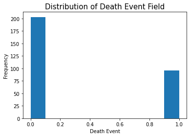
    


```python
print(df['anaemia'].nunique())
print(df['diabetes'].nunique())
print(df['high_blood_pressure'].nunique())
print(df['sex'].nunique())
print(df['smoking'].nunique())
```

    2
    2
    2
    2
    2
    

All these variables are binary variables.

**Split the data**


```python
train_df, test_df = train_test_split(df, test_size=0.3, random_state=123)
```


```python
train_df.head()
```


<div>
<style scoped>
    .dataframe tbody tr th:only-of-type {
        vertical-align: middle;
    }

    .dataframe tbody tr th {
        vertical-align: top;
    }

    .dataframe thead th {
        text-align: right;
    }
</style>
<table border="1" class="dataframe">
  <thead>
    <tr style="text-align: right;">
      <th></th>
      <th>age</th>
      <th>anaemia</th>
      <th>creatinine_phosphokinase</th>
      <th>diabetes</th>
      <th>ejection_fraction</th>
      <th>high_blood_pressure</th>
      <th>platelets</th>
      <th>serum_creatinine</th>
      <th>serum_sodium</th>
      <th>sex</th>
      <th>smoking</th>
      <th>time</th>
      <th>DEATH_EVENT</th>
    </tr>
  </thead>
  <tbody>
    <tr>
      <th>256</th>
      <td>65.0</td>
      <td>0</td>
      <td>326</td>
      <td>0</td>
      <td>38</td>
      <td>0</td>
      <td>294000.00</td>
      <td>1.70</td>
      <td>139</td>
      <td>0</td>
      <td>0</td>
      <td>220</td>
      <td>0</td>
    </tr>
    <tr>
      <th>125</th>
      <td>43.0</td>
      <td>1</td>
      <td>358</td>
      <td>0</td>
      <td>50</td>
      <td>0</td>
      <td>237000.00</td>
      <td>1.30</td>
      <td>135</td>
      <td>0</td>
      <td>0</td>
      <td>97</td>
      <td>0</td>
    </tr>
    <tr>
      <th>257</th>
      <td>58.0</td>
      <td>0</td>
      <td>132</td>
      <td>1</td>
      <td>38</td>
      <td>1</td>
      <td>253000.00</td>
      <td>1.00</td>
      <td>139</td>
      <td>1</td>
      <td>0</td>
      <td>230</td>
      <td>0</td>
    </tr>
    <tr>
      <th>239</th>
      <td>55.0</td>
      <td>1</td>
      <td>180</td>
      <td>0</td>
      <td>45</td>
      <td>0</td>
      <td>263358.03</td>
      <td>1.18</td>
      <td>137</td>
      <td>1</td>
      <td>1</td>
      <td>211</td>
      <td>0</td>
    </tr>
    <tr>
      <th>37</th>
      <td>82.0</td>
      <td>1</td>
      <td>855</td>
      <td>1</td>
      <td>50</td>
      <td>1</td>
      <td>321000.00</td>
      <td>1.00</td>
      <td>145</td>
      <td>0</td>
      <td>0</td>
      <td>30</td>
      <td>1</td>
    </tr>
  </tbody>
</table>
</div>


**Summary Statistics of training data**


```python
train_df.describe()
```


<div>
<style scoped>
    .dataframe tbody tr th:only-of-type {
        vertical-align: middle;
    }

    .dataframe tbody tr th {
        vertical-align: top;
    }

    .dataframe thead th {
        text-align: right;
    }
</style>
<table border="1" class="dataframe">
  <thead>
    <tr style="text-align: right;">
      <th></th>
      <th>age</th>
      <th>anaemia</th>
      <th>creatinine_phosphokinase</th>
      <th>diabetes</th>
      <th>ejection_fraction</th>
      <th>high_blood_pressure</th>
      <th>platelets</th>
      <th>serum_creatinine</th>
      <th>serum_sodium</th>
      <th>sex</th>
      <th>smoking</th>
      <th>time</th>
      <th>DEATH_EVENT</th>
    </tr>
  </thead>
  <tbody>
    <tr>
      <th>count</th>
      <td>209.000000</td>
      <td>209.000000</td>
      <td>209.00000</td>
      <td>209.000000</td>
      <td>209.000000</td>
      <td>209.000000</td>
      <td>209.000000</td>
      <td>209.000000</td>
      <td>209.000000</td>
      <td>209.000000</td>
      <td>209.000000</td>
      <td>209.000000</td>
      <td>209.000000</td>
    </tr>
    <tr>
      <th>mean</th>
      <td>60.003191</td>
      <td>0.425837</td>
      <td>583.22488</td>
      <td>0.392344</td>
      <td>38.258373</td>
      <td>0.363636</td>
      <td>265832.949809</td>
      <td>1.393589</td>
      <td>136.540670</td>
      <td>0.641148</td>
      <td>0.325359</td>
      <td>129.545455</td>
      <td>0.282297</td>
    </tr>
    <tr>
      <th>std</th>
      <td>11.738014</td>
      <td>0.495657</td>
      <td>992.57029</td>
      <td>0.489445</td>
      <td>11.990390</td>
      <td>0.482201</td>
      <td>101526.399271</td>
      <td>1.108673</td>
      <td>4.416917</td>
      <td>0.480815</td>
      <td>0.469634</td>
      <td>77.378621</td>
      <td>0.451198</td>
    </tr>
    <tr>
      <th>min</th>
      <td>40.000000</td>
      <td>0.000000</td>
      <td>47.00000</td>
      <td>0.000000</td>
      <td>14.000000</td>
      <td>0.000000</td>
      <td>47000.000000</td>
      <td>0.500000</td>
      <td>113.000000</td>
      <td>0.000000</td>
      <td>0.000000</td>
      <td>4.000000</td>
      <td>0.000000</td>
    </tr>
    <tr>
      <th>25%</th>
      <td>50.000000</td>
      <td>0.000000</td>
      <td>122.00000</td>
      <td>0.000000</td>
      <td>30.000000</td>
      <td>0.000000</td>
      <td>212000.000000</td>
      <td>0.900000</td>
      <td>134.000000</td>
      <td>0.000000</td>
      <td>0.000000</td>
      <td>73.000000</td>
      <td>0.000000</td>
    </tr>
    <tr>
      <th>50%</th>
      <td>60.000000</td>
      <td>0.000000</td>
      <td>250.00000</td>
      <td>0.000000</td>
      <td>38.000000</td>
      <td>0.000000</td>
      <td>263358.030000</td>
      <td>1.100000</td>
      <td>137.000000</td>
      <td>1.000000</td>
      <td>0.000000</td>
      <td>112.000000</td>
      <td>0.000000</td>
    </tr>
    <tr>
      <th>75%</th>
      <td>68.000000</td>
      <td>1.000000</td>
      <td>582.00000</td>
      <td>1.000000</td>
      <td>45.000000</td>
      <td>1.000000</td>
      <td>304000.000000</td>
      <td>1.300000</td>
      <td>139.000000</td>
      <td>1.000000</td>
      <td>1.000000</td>
      <td>205.000000</td>
      <td>1.000000</td>
    </tr>
    <tr>
      <th>max</th>
      <td>95.000000</td>
      <td>1.000000</td>
      <td>7861.00000</td>
      <td>1.000000</td>
      <td>80.000000</td>
      <td>1.000000</td>
      <td>850000.000000</td>
      <td>9.400000</td>
      <td>145.000000</td>
      <td>1.000000</td>
      <td>1.000000</td>
      <td>285.000000</td>
      <td>1.000000</td>
    </tr>
  </tbody>
</table>
</div>


```python
train_df['DEATH_EVENT'].value_counts()
```


    0    150
    1     59
    Name: DEATH_EVENT, dtype: int64


```python
corrMatrix = train_df.corr()
print(corrMatrix)
```

                                   age   anaemia  creatinine_phosphokinase  \
    age                       1.000000  0.151538                 -0.120675   
    anaemia                   0.151538  1.000000                 -0.153659   
    creatinine_phosphokinase -0.120675 -0.153659                  1.000000   
    diabetes                 -0.133554  0.001612                 -0.019500   
    ejection_fraction         0.064635  0.046114                 -0.064591   
    high_blood_pressure       0.050475  0.032916                 -0.017941   
    platelets                -0.072073 -0.088283                  0.006734   
    serum_creatinine          0.157094  0.116628                 -0.092847   
    serum_sodium             -0.074774  0.116126                  0.045689   
    sex                       0.074599 -0.122295                  0.101564   
    smoking                   0.008532 -0.123032                 -0.027768   
    time                     -0.159812 -0.128305                 -0.029608   
    DEATH_EVENT               0.203169  0.061818                  0.050710   
    
                              diabetes  ejection_fraction  high_blood_pressure  \
    age                      -0.133554           0.064635             0.050475   
    anaemia                   0.001612           0.046114             0.032916   
    creatinine_phosphokinase -0.019500          -0.064591            -0.017941   
    diabetes                  1.000000          -0.049306             0.044445   
    ejection_fraction        -0.049306           1.000000             0.017764   
    high_blood_pressure       0.044445           0.017764             1.000000   
    platelets                 0.145526           0.060051             0.026366   
    serum_creatinine         -0.084473          -0.015603             0.016882   
    serum_sodium             -0.034103           0.229380             0.017853   
    sex                      -0.154735          -0.133946            -0.077290   
    smoking                  -0.118789          -0.070496            -0.079130   
    time                      0.081533           0.092405            -0.118602   
    DEATH_EVENT              -0.046770          -0.295253             0.056248   
    
                              platelets  serum_creatinine  serum_sodium       sex  \
    age                       -0.072073          0.157094     -0.074774  0.074599   
    anaemia                   -0.088283          0.116628      0.116126 -0.122295   
    creatinine_phosphokinase   0.006734         -0.092847      0.045689  0.101564   
    diabetes                   0.145526         -0.084473     -0.034103 -0.154735   
    ejection_fraction          0.060051         -0.015603      0.229380 -0.133946   
    high_blood_pressure        0.026366          0.016882      0.017853 -0.077290   
    platelets                  1.000000         -0.048314      0.082567 -0.114966   
    serum_creatinine          -0.048314          1.000000     -0.222771  0.046891   
    serum_sodium               0.082567         -0.222771      1.000000 -0.025920   
    sex                       -0.114966          0.046891     -0.025920  1.000000   
    smoking                   -0.022701          0.024801     -0.017998  0.498254   
    time                      -0.011745         -0.111368      0.020683 -0.071084   
    DEATH_EVENT               -0.057236          0.240930     -0.158976  0.003817   
    
                               smoking      time  DEATH_EVENT  
    age                       0.008532 -0.159812     0.203169  
    anaemia                  -0.123032 -0.128305     0.061818  
    creatinine_phosphokinase -0.027768 -0.029608     0.050710  
    diabetes                 -0.118789  0.081533    -0.046770  
    ejection_fraction        -0.070496  0.092405    -0.295253  
    high_blood_pressure      -0.079130 -0.118602     0.056248  
    platelets                -0.022701 -0.011745    -0.057236  
    serum_creatinine          0.024801 -0.111368     0.240930  
    serum_sodium             -0.017998  0.020683    -0.158976  
    sex                       0.498254 -0.071084     0.003817  
    smoking                   1.000000  0.042588    -0.072517  
    time                      0.042588  1.000000    -0.540103  
    DEATH_EVENT              -0.072517 -0.540103     1.000000  
    


```python
corr_df = train_df.select_dtypes('number').corr('spearman').stack().reset_index(name='corr')
corr_df.loc[corr_df['corr'] == 1, 'corr'] = 0  # Remove diagonal
corr_df['abs'] = corr_df['corr'].abs()
corr_df
```


<div>
<style scoped>
    .dataframe tbody tr th:only-of-type {
        vertical-align: middle;
    }

    .dataframe tbody tr th {
        vertical-align: top;
    }

    .dataframe thead th {
        text-align: right;
    }
</style>
<table border="1" class="dataframe">
  <thead>
    <tr style="text-align: right;">
      <th></th>
      <th>level_0</th>
      <th>level_1</th>
      <th>corr</th>
      <th>abs</th>
    </tr>
  </thead>
  <tbody>
    <tr>
      <th>0</th>
      <td>age</td>
      <td>age</td>
      <td>0.000000</td>
      <td>0.000000</td>
    </tr>
    <tr>
      <th>1</th>
      <td>age</td>
      <td>anaemia</td>
      <td>0.137266</td>
      <td>0.137266</td>
    </tr>
    <tr>
      <th>2</th>
      <td>age</td>
      <td>creatinine_phosphokinase</td>
      <td>-0.107235</td>
      <td>0.107235</td>
    </tr>
    <tr>
      <th>3</th>
      <td>age</td>
      <td>diabetes</td>
      <td>-0.110279</td>
      <td>0.110279</td>
    </tr>
    <tr>
      <th>4</th>
      <td>age</td>
      <td>ejection_fraction</td>
      <td>0.080234</td>
      <td>0.080234</td>
    </tr>
    <tr>
      <th>...</th>
      <td>...</td>
      <td>...</td>
      <td>...</td>
      <td>...</td>
    </tr>
    <tr>
      <th>164</th>
      <td>DEATH_EVENT</td>
      <td>serum_sodium</td>
      <td>-0.147697</td>
      <td>0.147697</td>
    </tr>
    <tr>
      <th>165</th>
      <td>DEATH_EVENT</td>
      <td>sex</td>
      <td>0.003817</td>
      <td>0.003817</td>
    </tr>
    <tr>
      <th>166</th>
      <td>DEATH_EVENT</td>
      <td>smoking</td>
      <td>-0.072517</td>
      <td>0.072517</td>
    </tr>
    <tr>
      <th>167</th>
      <td>DEATH_EVENT</td>
      <td>time</td>
      <td>-0.559535</td>
      <td>0.559535</td>
    </tr>
    <tr>
      <th>168</th>
      <td>DEATH_EVENT</td>
      <td>DEATH_EVENT</td>
      <td>0.000000</td>
      <td>0.000000</td>
    </tr>
  </tbody>
</table>
<p>169 rows × 4 columns</p>
</div>


**Pairwise Correlation Plots**


```python
numeric_cols=['age','creatinine_phosphokinase','ejection_fraction','platelets','serum_creatinine', 'serum_sodium','time']
pair = alt.Chart(train_df).mark_point(opacity=0.3, size=10).encode(
      alt.X(alt.repeat('row'), type='quantitative',
            scale=alt.Scale(zero=False)),
      alt.Y(alt.repeat('column'), type='quantitative',
            scale=alt.Scale(zero=False))
).properties(
    width=100,
    height=120).repeat(
    column=numeric_cols,
    row=numeric_cols
).configure_axis(
    labelFontSize=8,
    titleFontSize=8
)


# Show the plot
pair
```


    

    


```python
import seaborn as sns
sns.pairplot(df)
```


    <seaborn.axisgrid.PairGrid at 0x14973d83430>


    

    


```python
numeric_cols=['age','creatinine_phosphokinase','ejection_fraction','platelets','serum_creatinine', 'serum_sodium','time']
plot = alt.Chart(train_df).mark_bar().encode(
     alt.X(alt.repeat(), type="quantitative", bin=alt.Bin(maxbins=20)),
     alt.Y("count()"),
     color ='DEATH_EVENT'
     ).properties(
    width=300,
    height=200).repeat(numeric_cols, columns = 2)

plot
```


    
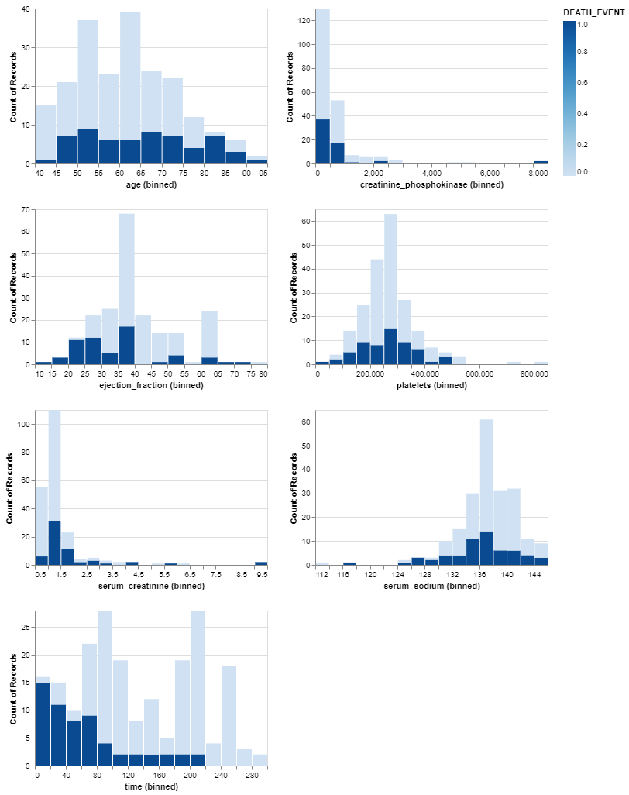
    


```python
corr_df = (
    train_df.drop(['sex', 'time'], axis = 1)
    .corr('spearman')
    .abs()
    .stack()
    .reset_index(name='corr'))
alt.Chart(corr_df).mark_rect().encode(
    x='level_0',
    y='level_1',
    size='corr',
    color='corr')
```


    
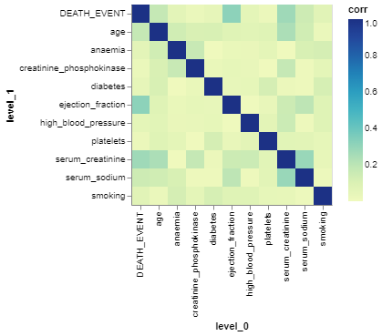
    


```python
plt.figure(figsize = (15,8))
sns.heatmap(train_df.drop(['sex', 'diabetes', 'high_blood_pressure','anaemia'], axis =1).corr(), annot = True)
```


    <AxesSubplot:>


    
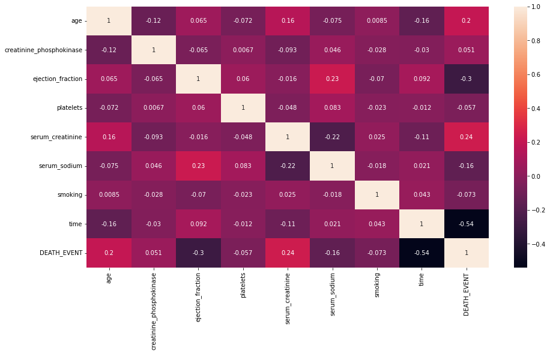
    


**Interpretation:**
1. Very negligible multicollinearity is present between the numeric variables in the given dataset.
2. We have dropped the binary variables since they may not contribute to multicollinearity

### Analysis of Binary variables:


```python
binary_var = df[['sex', 'diabetes', 'high_blood_pressure','anaemia']]
```

#### 1. Relation of "SEX" variable with Death Event: 


```python
sns.countplot(x='DEATH_EVENT', hue = 'sex', data = df)
```


    <AxesSubplot:xlabel='DEATH_EVENT', ylabel='count'>


    
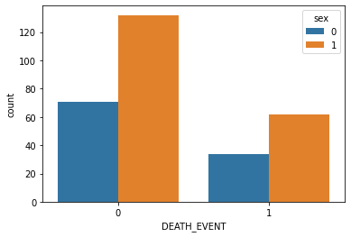
    


```python
np.round(df.groupby('DEATH_EVENT')['sex'].value_counts(normalize = True)*100)
```


    DEATH_EVENT  sex
    0            1      65.0
                 0      35.0
    1            1      65.0
                 0      35.0
    Name: sex, dtype: float64


Almost same percentage of men and women have survived or faced death by heart failure.

### 2. Relation of "Diabetes" variable with Death Event: 


```python
sns.countplot(x='DEATH_EVENT', hue = 'diabetes', data = df)
```


    <AxesSubplot:xlabel='DEATH_EVENT', ylabel='count'>


    
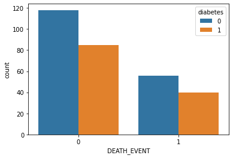
    


```python
np.round(df.groupby('DEATH_EVENT')['diabetes'].value_counts(normalize = True)*100)
```


    DEATH_EVENT  diabetes
    0            0           58.0
                 1           42.0
    1            0           58.0
                 1           42.0
    Name: diabetes, dtype: float64


Heart Failure rate recorded is similar in diabetic as well as non-diabetic patients.

### 3. Relation of "Anaemia" variable with Death Event: 


```python
sns.countplot(x='DEATH_EVENT', hue = 'anaemia', data = df)
```


    <AxesSubplot:xlabel='DEATH_EVENT', ylabel='count'>


    
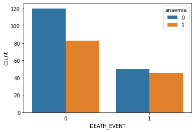
    


```python
np.round(df.groupby('DEATH_EVENT')['anaemia'].value_counts(normalize = True)*100)
```


    DEATH_EVENT  anaemia
    0            0          59.0
                 1          41.0
    1            0          52.0
                 1          48.0
    Name: anaemia, dtype: float64


The Death Rate is almost similar for anaemic and non-anaemic patients. However, possibility of survival is slightly higher in non-anaemic patients than in anaemic patients.

### 4. Relation of "High Blood Pressure" variable with Death Event: 


```python
sns.countplot(x='DEATH_EVENT', hue = 'high_blood_pressure', data = df)
```


    <AxesSubplot:xlabel='DEATH_EVENT', ylabel='count'>


    
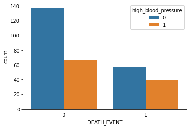
    


```python
np.round(df.groupby('high_blood_pressure')['DEATH_EVENT'].value_counts(normalize = True)*100)
```


    high_blood_pressure  DEATH_EVENT
    0                    0              71.0
                         1              29.0
    1                    0              63.0
                         1              37.0
    Name: DEATH_EVENT, dtype: float64


The death percentage by heart failure is more in individuals with high blood pressure. Stil, there is a huge difference between those who have survived and encountered death despite having high blood pressure.

### 5. Relation of "Smoking" variable with Death Event: 


```python
sns.countplot(x='DEATH_EVENT', hue = 'smoking', data = df)
```


    <AxesSubplot:xlabel='DEATH_EVENT', ylabel='count'>


    

    


```python
np.round(df.groupby('smoking')['DEATH_EVENT'].value_counts(normalize = True)*100)
```


    smoking  DEATH_EVENT
    0        0              67.0
             1              33.0
    1        0              69.0
             1              31.0
    Name: DEATH_EVENT, dtype: float64


Similar percentage of smokers and non-smokers have faced death due to heart failure.

### Analysis of Numeric variables:


```python
numeric_var = df[['age', 'creatinine_phosphokinase',
       'ejection_fraction', 'platelets',
       'serum_creatinine', 'serum_sodium', 'time']]
```


```python
for c in numeric_var.columns:
    sns.barplot(x='DEATH_EVENT', y=c, data=df)
    plt.show()
```


    
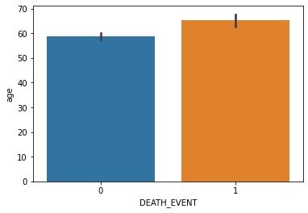
    


    
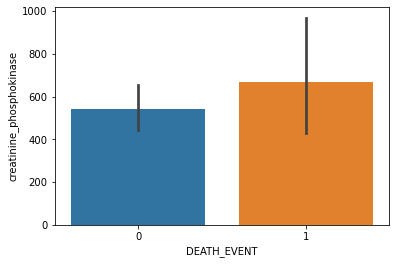
    


    
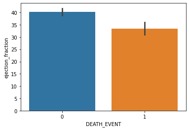
    


    
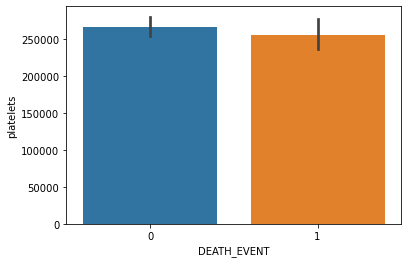
    


    
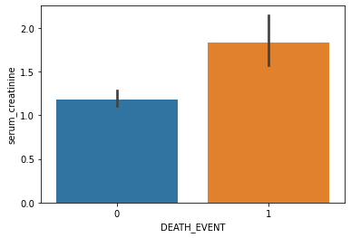
    


    

    


    

    


**Interpretation:**
1. The mean age of people who experieced death by heart failure is higher than those who survived.
2. Average amount of creatinine_phosphokinase in heart_failure_deaths is greater.
3. The Ejection Fraction is higher in survivors.
4. The platelet counts are observed to be slightly lower in heart_failure patients.
5. Those with higher level of creatin are more likely to face heart failure.
6. Level of sodium is almost the same in survivors and dead patients.
7. People with more followup period are more likely to survive. 


```python

```
